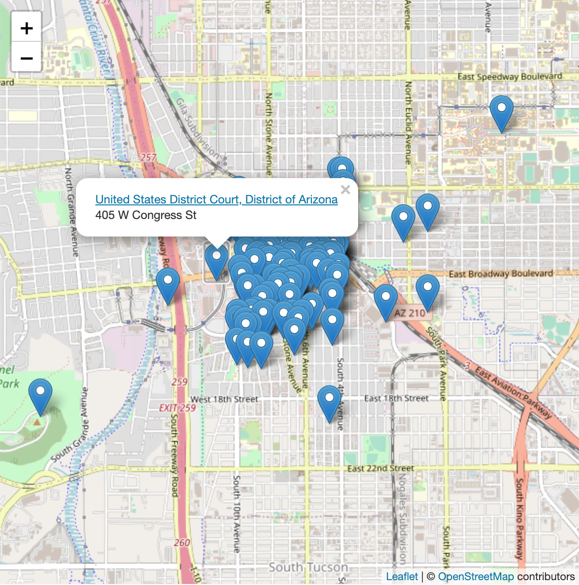
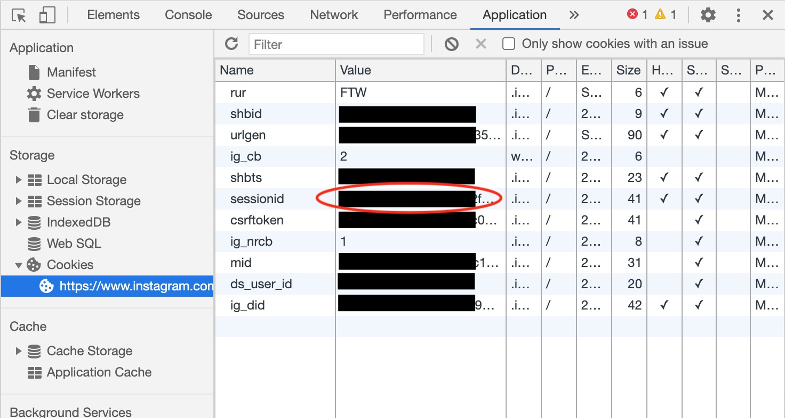

# Instagram Location Search

## Prerequisites

This Python application requires `requests`, `numpy`, and `pandas` to be properly installed. This can be done with `pip3 install requests numpy pandas`.

## Example usage

The following command will search for Instagram locations nearby the coordinates 32.22 N, 110.97 W (downtown Tucson, Arizona.) The list of locations is saved as a CSV file at "locs.csv".

```python3 instagram-locations.py --session "<session-id-token>" --lat 32.22 --lng -110.97 --csv locs.csv```

Note that this requires an Instagram session ID in order to work! See below for how to obtain one from your account.

## Example usage with date

The following command will search for Instagram locations near Seattle's "Capitol Hill Autonomous Zone" during the George Floyd
protests in early June, 2020. Not all location pages in the area will have posts relevant to the Zone, but some do. Open the
resulting `map.html` file in your browser to view locations.

```python3 instagram-locations.py --session "<session-id-token>" --lat 47.6164311 --lng -122.3203952 --map map.html --date 2020-06-09```

When using the `--date` argument, links to Instagram location pages will be filtered to show posts created on this date or earlier.
Instagram will usually first show a 3x3 grid of "Top Images and Videos" that are more recent, however once you scroll past that
there is a section labeled "Most recent" which will show the posts sorted by date (if any).
These links are only used together with the `--csv` and `--map` arguments, they aren't included in `--json` or `--geojson`.
Note: Instagram treats these dates as "UTC", which is a timezone near Great Britain. If your target location is far from this zone,
it's worth adding a couple of days to your filter to make sure you capture all relevant posts. Also, this only specifies the
*maximum* post date that can be displayed. If nothing was posted that day at that location, it will show older posts (sometimes
even multiple years older).

### Other output formats

Using the `--json <output-location>` command line argument, the list can be saved as a JSON file, almost identical to the raw API response.

Using the `--geojson <output-location>` command line argument, the list can be saved as a GeoJSON file for other geospatial applications.

Using the `--map <output-location>` command line argument, a simple Leaflet map is made to visualize the locations of the returned points.



Multiple types of output can be generated. For example, the following command will search for Instagram locations, save the JSON list, a CSV file, and a map for viewing the locations visually.

```python3 instagram-locations.py --session "3888090946%3AhdKd2fA8d72dqD%3A16" --lat 32.22 --lng -110.97 --json locs.json --csv locs.csv --map map.html```

## Getting an Instagram session ID

__Important: an Instagram session ID should be treated like a password — it provides full access to the Instagram account. Using this session ID in multiple places or on multiple computers may trigger Instagram to invalidate all session IDs. Using this session ID for any purpose other than the official Instagram website or application may be a violation of the Instagram Terms of Service and could lead to account suspension.__

1. In Google Chrome, log-in to Instagram.
2. Right click on the page and press "Inspect" to bring up the Chrome Developer Tools.
3. Click the "Application" tab in the Developer Tools Box.
4. Under "Cookies" select "https://www.instagram.com."
5. The value next to "sessionid" is your Instagram session ID.


